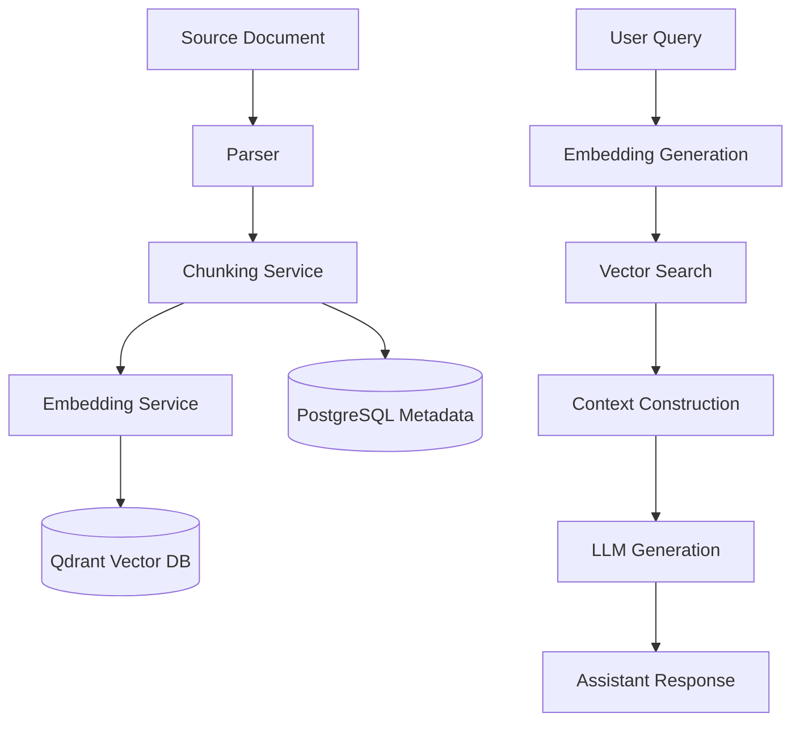

# RAG (Retrieval-Augmented Generation) Pipeline

Detailed technical overview of the Foxmayn RAG system, optimized for semantic document search and AI-powered context-aware interactions.

---

## 1. Architecture

The pipeline consists of three main stages: **Ingestion**, **Storage**, and **Retrieval**.



---

## 2. RAG Profiles

A **RAG Profile** acts as a blueprint for the pipeline. It allows users to customize exactly how documents are processed and how the AI responds.

| Category        | Settings                                                              |
| --------------- | --------------------------------------------------------------------- |
| **Processing**  | Embedding model, chunk size, overlap, separators, contextual prefixes |
| **Retrieval**   | Strategy (similarity/MMR), top-K results, score threshold             |
| **Generation**  | LLM model (Gemini, Claude, GPT), temperature, max tokens, top-P       |
| **Personality** | Tone, language, assistant/company name, system prompt, citations      |

---

## 3. Data Schema

### 3.1 PostgreSQL (Relational Context)

- `rag_profile`: Stores configuration blueprints.
- `document`: Metadata for ingested files.
- `document_chunk`: Maps text fragments to vector point IDs.
- `conversation`: Tracks session groups.
- `message`: Stores the full chat transcript.

### 3.2 Qdrant (Vector Context)

Vector points are stored in the `documents` collection with the following payload structure:

```json
{
	"documentId": "uuid",
	"profileId": "uuid",
	"content": "Original chunk text...",
	"source": "Optional origin URL",
	"createdAt": "ISO-Timestamp"
}
```

---

## 4. Chat History Modes

The API supports two distinct ways to manage conversation state:

### 4.1 Client-Managed

The frontend maintains the full history.

- **Request**: Sends a `messages` array.
- **Benefit**: Total control over history trimming and context.
- **Stateless**: Server does not store anything.

### 4.2 Server-Managed

The API handles persistence and retrieval.

- **Request**: Sends a `conversationId`.
- **Flow**: Server fetches prior messages from DB, appends to context, and stores the new exchange.
- **Streaming**: Yields a `conversation_id` chunk first for newly created sessions.

---

## 5. Usage Examples

### Ingesting with a Specific Profile

Assign a `profileId` during upload to use specific chunking/embedding settings:

```bash
POST /api/v1/documents
{
  "title": "Technical Specs",
  "content": "...",
  "profileId": "custom-dev-profile-id"
}
```

### Querying with Context

Retrieve the top 5 most relevant fragments with a similarity threshold of 0.4:

```bash
POST /api/v1/chat/query
{
  "query": "How do I install the SDK?",
  "options": {
    "limit": 5,
    "scoreThreshold": 0.4,
    "profileId": "documentation-profile"
  }
}
```

---

_Last Updated: January 2026_
